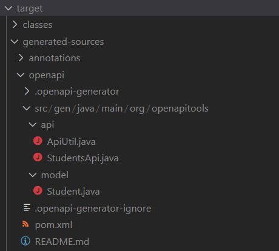

# API First Driven Development
## Project Description
A simple example of "API First Driven Development" using the OpenAPI and Springboot. 

A predetermined OpenAPI spec is used to generate a REST Controller Interface and its associated response Models.

The generated code is then integrated into the codebase ensuring that the OpenAPI spec is the '<i>single source of truth</i>' that represents the true behavior of the underlying service.

## OpenAPI Spec & code generation
The OpenAPI spec can be located in the api module of the root directory.

The Interface & Model for the StudentController class are generated at compile time & can be found in the below location:

</img>

## Frameworks Used
- SpringBoot
- OpenAPI
- SwaggerUI